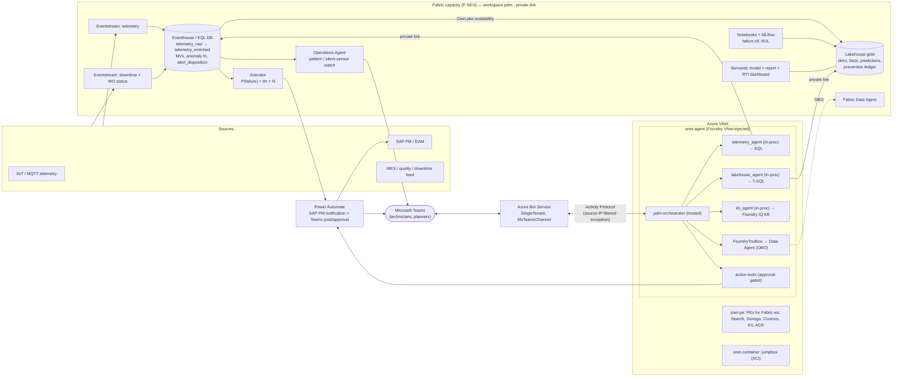

# Predictive Maintenance on Fabric RTI + Foundry + Teams — Deployment Plan v2 (Bicep + Python)

Re-plan of v1 (`DEPLOYMENT_PLAN.md`), rebuilt on the deployment patterns proven in two reference repos:

- **`foundry-iq-v2`** — private multi-agent orchestration: hosted MAF agents, Foundry IQ knowledge base, Fabric Data Agent through a Foundry Toolbox (OBO), direct-T-SQL lakehouse agent, Bot Service + Teams publish, numbered Bicep, `azd` + jumpbox.
- **`fleet-ops-copilot`** — real-time telemetry on Fabric RTI: Eventstream → Eventhouse (update policy), Fabric **Operations Agent** for proactive alerts, Foundry hosted agent with a direct Kusto tool, approval-gated actions, Bot Service + Teams, three Bicep "waves", `state.json` seam, vendored Microsoft standard-agent Bicep.

The solution scope (KPIs, models, shadow mode, closed loop) is unchanged from the solution plan; this document changes **how it is deployed and where the agent surfaces** (Microsoft Teams, via Azure Bot Service).

Legend: **[B]** Bicep · **[P]** Python · **[S]** shell/azd hook · **[M]** manual · **[R]** pattern taken from a reference repo (I read it; I have not run it) · **[V]** verify against current docs before building.

---

## 0. What changes versus v1

| Topic | v1 | v2 (why) |
|---|---|---|
| Foundry Bicep | Hand-written account/project | **Vendor Microsoft's `15-private-network-standard-agent-setup`** (as fleet-ops does). Standard agent setup needs BYO Search + Storage + Cosmos and a capability host; hand-writing it is a trap **[R]** |
| Agent runtime | Container App + RTI MCP server; guessed SDK calls | **Foundry hosted agents** (Microsoft Agent Framework, `ResponsesHostServer`), real API shape from the repos. **No Container Apps, no RTI MCP host** — the agent queries Eventhouse in-process with `azure-kusto-data` under its own identity **[R]** |
| Agent design | One agent + tools | **Orchestrator + specialist agents** wired in-process via `Agent.as_tool()` (Foundry-to-Foundry A2A is a documented platform bug in the reference repo) **[R]** |
| RAG | Plain AI Search index | **Foundry IQ Knowledge Source + Knowledge Base** over Search, consumed with `AzureAISearchContextProvider` **[R]** |
| Fabric data access for agent | Data Agent tool (noted OBO caveat) | **Two lanes**: (a) Fabric Data Agent through a **Foundry Toolbox with `UserEntraToken` connection** for interactive users; (b) **service-identity lane** — direct KQL + direct T-SQL on the Lakehouse SQL endpoint — for scheduled agents (shift briefing, RCA). This resolves the v1 open issue **[R]** |
| Proactive alerting | Activator only | **Activator** for the contractual threshold rule **+ Fabric Operations Agent** for narrative/pattern watch; alert lands in Teams with a deep link into the PdM agent **[R]** |
| Teams | Logic App card | **Bot Service + Foundry-native Teams publish** for the conversational agent; Power Automate for proactive posts and the SAP action **[R]** |
| Network | "Public, harden later" | **Private-by-design**: VNet-injected Foundry, private endpoints, Fabric workspace private link, jumpbox (ACI) for data-plane steps. Includes the ordering quirks the repos discovered **[R]** |
| Orchestration | Python CLI stages | **`azd provision` + pre/postprovision hooks + numbered `setup/NN_*.py` + `state.json`** seam; three Bicep waves **[R]** |
| Deploy identity | SP with OIDC everywhere | **Split**: control-plane in CI (SP), but Operations Agent create, Teams publish and workspace-role grants need a **delegated human** session **[R]** |

---

## 1. Division of labour

| Layer | Tool | Owns |
|---|---|---|
| Azure platform | **Bicep (3 waves)** via `azd provision` / `deploy.ps1 -Wave N` | VNet + subnets + private DNS, Fabric capacity, Key Vault, Log Analytics/App Insights, ACR, jumpbox (ACI), vendored Foundry standard agent (account, project, models, capability hosts, connections), Fabric workspace private link, Bot Service + Teams channel, RBAC |
| Fabric items | **Python** `setup/NN_*.py` (+ `fabric-cicd` for item bundles) | Workspace, roles, Eventhouse/KQL DB, Eventstreams, Lakehouse, notebooks, pipelines, semantic model, Activator, Data Agent, Operations Agent |
| Data plane config | **Python** | KQL tables/policies/functions/MVs, Delta DDL, seeds, KB build |
| Foundry runtime | **Python + REST** `foundry/*.py` | Hosted agent versions, agent PATCH (activity protocol), `microsoft365/publish`, toolbox + connection, evals |
| Manual (no API) | Human | Fabric tenant settings, Operations Agent *Generate Playbook* + *Start*, Activator rule authoring/export, M365 admin approval for tenant-scope Teams app, SAP/Power Automate connections |

Rules carried over from the repos:
1. **`state.json` is the seam** between Bicep outputs and Python-created IDs; every script reads its inputs from it and writes outputs back, so a failed step re-runs safely. Never commit real values **[R]**.
2. Everything idempotent (`create-merge`, find-or-create by displayName).
3. No secrets in code: Key Vault + managed/agent identity. Power Automate trigger URL is a KV secret **[R]**.
4. Each step ends with a **"✅ check before proceeding"** gate (§13).

---

## 2. Target architecture (deployment view)



Two Teams surfaces, deliberately different:

1. **Conversational** — the PdM agent, published through Bot Service. Request/response only (Activity Protocol); it cannot initiate a message.
2. **Proactive** — Activator / Operations Agent / Power Automate push the alert, shift briefing and RCA link into Teams; each carries an `alert_id` and a deep link `https://teams.microsoft.com/l/app/<teamsAppId>` so the technician continues the conversation with the agent, which loads the alert context and captures the disposition.

---

## 3. Repo layout

```
pdm-fabric-foundry/
├─ azure.yaml                         # azd: infra path + pre/postprovision hooks
├─ .env.example   requirements.txt    state.json (gitignored, runtime)
├─ infra/
│  ├─ wave0-byo-resources.bicep       # AI Search, Storage, Cosmos DB (BYO for Foundry standard agent) [R]
│  ├─ main.bicep  main.bicepparam     # WAVE 1: network, capacity, KV, monitoring, ACR, jumpbox, Foundry
│  ├─ wave2-fabric-privatelink.bicep  # workspace-level private link (needs workspaceId from state.json)
│  ├─ wave3-bot.bicep                 # Bot Service + Teams channel (needs agent client id + activity endpoint)
│  ├─ deploy.ps1                      # `-Wave 1|2|3`
│  ├─ hooks/{pre,post}provision.{sh,ps1}
│  └─ modules/
│     ├─ network.bicep  private-endpoint.bicep  keyvault.bicep  monitoring.bicep
│     ├─ fabric-capacity.bicep  aci-jumpbox.bicep  aci-foundry-rbac.bicep  rbac.bicep
│     ├─ foundry.bicep                # thin wrapper over the vendored sample
│     └─ foundry-vendored/            # Microsoft foundry-samples 15-private-network-standard-agent-setup — DO NOT EDIT
├─ artifacts/
│  ├─ kql/{010_tables,020_functions,030_update_policies,040_mv,050_retention,060_onelake,070_anomaly,080_disposition}.kql
│  ├─ eventstream.telemetry.definition.json  eventstream.downtime.definition.json
│  ├─ ops-agent/OperationsAgentV1.json      # captured from portal once, then reused [R]
│  ├─ activator/                            # exported reflex definition
│  ├─ fabric/                               # notebooks, pipelines, semantic model, report (fabric-cicd)
│  ├─ kb/                                   # OEM manuals, SOPs, past repair write-ups (Foundry IQ source docs)
│  └─ teams/README.md                       # manifest is generated by Foundry publish; do not hand-author [R]
├─ src/pdmops/
│  ├─ common/{auth,config,fabric_client,kusto_client,graph_client,foundry_network,logging_setup}.py
│  ├─ setup/
│  │  ├─ 01_workspace.py   02_eventhouse.py   03_kql_schema.py   04_eventstreams.py
│  │  ├─ 05_lakehouse_gold.py  06_items_publish.py  07_semantic.py  08_ml.py
│  │  ├─ 09_activator_ops_agent.py   10_network_policy.py
│  ├─ foundry/
│  │  ├─ _rest.py  deploy_agents.py  build_kb.py  create_toolbox.py  publish_teams.py  evals.py
│  │  └─ agents/{orchestrator,telemetry,lakehouse,kb}/{main.py,Dockerfile,requirements.txt}
│  ├─ actions/{approval,work_order,disposition,power_automate}.py   # approval gate [R]
│  └─ validate/{smoke_kql,network_check,kpi_reconcile,agent_direct,e2e_flow}.py
├─ scripts/{capture_wave1_state.py, set_fabric_capacity_state.sh}   # resume/suspend [R]
└─ .github/workflows/{infra.yml,fabric.yml,agent.yml}
```

---

## 4. Stage plan

Waves come from the reference repos; stages map to the 20-week delivery plan.

| Stage | Wk | Tool | What | Where it runs | Exit gate |
|---|---|---|---|---|---|
| **S0** Prereqs | 0 | M | Tenant settings, quotas, providers, identities, region decision (§5) | admin | Checklist signed |
| **W0** BYO resources | 1 | B | Search, Storage, Cosmos | local | Resource IDs in `main.bicepparam` |
| **W1** Platform | 1 | B+S+P | `azd provision`: network, capacity, KV, monitoring, ACR, jumpbox, Foundry standard agent; postprovision: workspace, Eventhouse, KQL schema, Eventstreams | local (delegated user) | `smoke_kql` shows telemetry rows; capability host `Succeeded` |
| **S3** Jumpstart + gap map | 1 | M+P | Install Jumpstart into workspace **[V]**; inventory vs target | local | `docs/gap-map.md`; downtime-data risk decision |
| **S4** Data foundation | 2–5 | P | Downtime/WO Eventstream, gold Delta, dims, OneLake availability, frozen baseline | local | Contract tests green; baseline hash committed |
| **S5** KPI layer | 4–6 | P | Semantic model, report, RTI dashboard | local | KPI reconciliation ≤0.5% |
| **S6** AI models | 6–10 | P | Anomaly fn, features, classifier, RUL, batch scoring, shadow mode | local | Shadow rows in `fact_prediction`; scorecard live |
| **W2** Fabric private link | 10 | B+P | Workspace private link, lock workspace to `Deny` | local; only the DNS check needs the jumpbox. **Last and optional**: run after every Fabric item is built (see §8) | `network_check` private IP; policy shows `Deny` |
| **S7** Closed loop | 10–13 | P+M | Activator rule, Power Automate flow, SAP notification, disposition table, Ops Agent | local + portal | Synthetic alert → notification + disposition row |
| **W3a** Agents | 12–15 | P | KB build, hosted agents deploy, toolbox, evals | local while the Foundry account is public (it must be, until Teams publish, §9.2); jumpbox only if the project is later locked to private | `agent_direct` returns grounded answers; evals pass |
| **W3b** Teams | 14–16 | B+P | Bot Service, activity-protocol PATCH, `microsoft365/publish`, lock Foundry private | local (**delegated human**) | `teamsAppId` returned; message reaches agent in Teams |
| **S9** Value + promote | 16–20 | CI | Dev→test→prod, finance-signed formulas, scale-out template | CI | Runbook, prevented-hours signed |

---

## 5. S0 — Prerequisites (lifted from both repos' "Prerequisites" sections)

**Fabric admin portal tenant settings**
- **Azure Private Link** (≈15 min to propagate) and **Configure workspace-level inbound network rules**.
- Copilot / Azure OpenAI switches required by the **Operations Agent** and **Data Agent**.
- Service principals can use Fabric APIs (for CI-driven steps); Activator, Data Science, OneLake availability enabled.

**Azure**
- Providers registered: `Microsoft.Fabric`, `Microsoft.BotService`, `Microsoft.App`, `Microsoft.CognitiveServices`, `Microsoft.Search`, `Microsoft.DocumentDB`, `Microsoft.Storage`, `Microsoft.KeyVault`, `Microsoft.ContainerRegistry`, `Microsoft.ContainerInstance`. Re-register `Microsoft.Fabric` the first time workspace-level private link is used **[R]**.
- **Region decision (do this first)** **[R]**:
  - Avoid `eastus` (Operations Agent unavailable) and `westus` (hosted-agent invocation route took 15–40+ min or never resolved). `swedencentral` worked immediately in the reference.
  - Check **Fabric capacity quota** in the candidate region — one reference subscription had `0` in `uksouth`:
    `az rest --method get --url "https://management.azure.com/subscriptions/<sub>/providers/Microsoft.Fabric/locations/<region>/usages?api-version=2023-11-01"` (need `limit` ≥ the F-SKU vCores, e.g. 8 for F8).
  - Co-locate capacity and Foundry; check model quota (chat + `text-embedding-3-large`).
- Fabric **workspaces are region-pinned to their capacity**: never plan to "move" a capacity — ARM move of `Microsoft.Fabric` times out; create a new capacity and reassign workspaces **[R]**.

**Identities**
- Operator (real user, not an SP) signed in with `az login` + `azd auth login` for everything marked *delegated*.
- Groups: `grp-pdm-admin`, `grp-pdm-data`, `grp-pdm-ops` (technicians — Teams users), `grp-pdm-approvers` (may approve SAP writes / dispositions).
- CI SP (`sp-pdm-deploy`) limited to Bicep and Fabric control-plane steps that support SPs; **not** used for Ops Agent, `microsoft365/publish`, or workspace-role grants to agent identities.

---

## 6. Wave 0 + Wave 1 — Bicep and `azd provision`

### 6.1 `azure.yaml` (pattern from fleet-ops)

```yaml
name: pdm-fabric-foundry
infra:
  provider: bicep
  path: infra
  module: main
hooks:
  preprovision:
    windows: { shell: pwsh, run: ./infra/hooks/preprovision.ps1 }
    posix:   { shell: sh,   run: ./infra/hooks/preprovision.sh }
  postprovision:
    windows: { shell: pwsh, run: ./infra/hooks/postprovision.ps1 }
    posix:   { shell: sh,   run: ./infra/hooks/postprovision.sh }
```

`preprovision` prompts for (defaults on Enter): resource-group name, Foundry account base name (deterministic suffix appended), Fabric capacity name, **hosted agent name** (no spaces) — and writes them into `.env` **[R]**.

### 6.2 `wave0-byo-resources.bicep`

Creates AI Search, Storage and Cosmos DB accounts (the Foundry standard agent setup refuses to build without all three). Use existing ones if the customer has them; pass IDs into `main.bicepparam` **[R]**. Search: Standard S1 for prod with semantic ranker (needed by Foundry IQ knowledge bases **[V]**).

### 6.3 `main.bicep` (Wave 1) — composition

```bicep
targetScope = 'subscription'

param location string = 'swedencentral'
param resourceGroupName string = 'rg-pdm-dev'
param fabricAdminMembers array               // UPNs of capacity admins
param operatorPrincipalId string             // az ad signed-in-user show --query id -o tsv
param fabricCapacityName string = 'pdmf8dev'
param fabricSku string = 'F8'
param foundryAiServicesBaseName string = 'pdmai'
param foundryProjectName string = 'pdm-agents'
param foundryModelName string = 'gpt-4.1'
param foundryModelVersion string = '2025-04-14'
param foundryModelSkuName string = 'GlobalStandard'
param foundryModelCapacity int = 50
param aiSearchResourceId string
param azureStorageAccountResourceId string
param azureCosmosDBAccountResourceId string
param enableContainerRegistry bool = true    // agents are image-based (see §9)
param publicNetworkAccessAtCreation bool = true   // <-- see §9.2: agent routes only register if public at deploy

resource rg 'Microsoft.Resources/resourceGroups@2024-03-01' = { name: resourceGroupName, location: location }

module network   'modules/network.bicep'         = { scope: rg, name: 'network',   params: { location: location } }
module capacity  'modules/fabric-capacity.bicep' = { scope: rg, name: 'capacity',  params: { name: fabricCapacityName, location: location, sku: fabricSku, adminMembers: fabricAdminMembers } }
module kv        'modules/keyvault.bicep'        = { scope: rg, name: 'kv',        params: { location: location } }
module monitoring 'modules/monitoring.bicep'     = { scope: rg, name: 'monitoring', params: { location: location } }
module jumpbox   'modules/aci-jumpbox.bicep'     = { scope: rg, name: 'jumpbox',   params: { location: location, subnetId: network.outputs.containerSubnetId } }
module foundry   'modules/foundry.bicep'         = {
  scope: rg
  name: 'foundry'
  params: {
    location: location
    aiServicesBaseName: foundryAiServicesBaseName
    projectName: foundryProjectName
    modelName: foundryModelName
    modelVersion: foundryModelVersion
    modelSkuName: foundryModelSkuName
    modelCapacity: foundryModelCapacity
    aiSearchResourceId: aiSearchResourceId
    azureStorageAccountResourceId: azureStorageAccountResourceId
    azureCosmosDBAccountResourceId: azureCosmosDBAccountResourceId
    enableContainerRegistry: enableContainerRegistry
    publicNetworkAccessAtCreation: publicNetworkAccessAtCreation
    agentSubnetId: network.outputs.agentSubnetId
    peSubnetId: network.outputs.peSubnetId
  }
}
module operatorKv 'modules/rbac.bicep' = { scope: rg, name: 'operatorKv', params: { principalId: operatorPrincipalId, keyVaultName: kv.outputs.name } }
module jumpboxAccess 'modules/aci-foundry-rbac.bicep' = { scope: rg, name: 'jumpboxAccess', params: { jumpboxPrincipalId: jumpbox.outputs.principalId, foundryAccountName: foundry.outputs.accountName } }

// Names match state.json keys / azd env so postprovision can capture them
output resourceGroup string = rg.name
output fabricCapacityName string = capacity.outputs.name
output foundryAccountName string = foundry.outputs.accountName
output foundryAccountId string = foundry.outputs.accountId
output foundryProjectName string = foundry.outputs.projectName
output acrName string = foundry.outputs.acrName
output keyVaultUri string = kv.outputs.uri
output jumpboxName string = jumpbox.outputs.name
```

`fabric-capacity.bicep` is unchanged from v1 (`Microsoft.Fabric/capacities@2023-11-01`; `state` is read-only — Bicep cannot pause/resume).

Foundry account name uses a deterministic `uniqueString(...)`. **Known trap [R]:** a torn-down account leaves a soft-deleted Cognitive Services account + backing AML workspace that blocks re-deployment with the same name; `purge` and `azd down --purge` were unreliable — the dependable fix is changing the **salt string** so Bicep derives a fresh name.

The capability-host step takes **30–35 min** — expected, not a hang. If the capability host does not come up, run `foundry-vendored/createCapHost.sh` **[R]**.

### 6.4 Foundry RBAC and networking notes

- Vendored sample provides private endpoints + DNS zones, the agent subnet delegated to `Microsoft.App/environments`, project/account capability hosts, Cosmos/Storage/Search connections.
- Our additions (RBAC, per-agent identity grants) happen **after** agents exist (§9.4) because agent identities do not exist at Bicep time.
- Fabric capacity: separate capacities for prod vs dev/test; dev is suspended off-hours with `scripts/set_fabric_capacity_state.sh suspend|resume` **[R]**.

### 6.5 `postprovision` hook (runs the Fabric phase)

```sh
#!/usr/bin/env bash
set -euo pipefail
cd "$(git rev-parse --show-toplevel)"
[ -d .venv ] || python3 -m venv .venv
.venv/bin/pip install -q -r requirements.txt
export PYTHONPATH=src PDMOPS_FORCE_CLI_CREDENTIAL=1     # human's `az login`, not managed identity [R]

.venv/bin/python scripts/capture_wave1_state.py         # Bicep outputs -> state.json
scripts/set_fabric_capacity_state.sh resume "$FABRIC_CAPACITY_NAME"
.venv/bin/python src/pdmops/setup/01_workspace.py       # workspace -> capacity, roles
.venv/bin/python src/pdmops/setup/02_eventhouse.py      # Eventhouse + KQL DB
.venv/bin/python src/pdmops/setup/03_kql_schema.py      # artifacts/kql/*.kql
.venv/bin/python src/pdmops/setup/04_eventstreams.py --apply
cat <<'EOF'
Wave 1 + Fabric foundation live. Next: S4/S5/S6 (data, KPIs, models), then Wave 2, Wave 3.
EOF
```

---

## 7. Fabric phase (S2–S7) — Python

Same content as v1 §6–§11 with these adjustments:

1. **Numbered setup scripts + `state.json`** replace the `pdmctl` stage CLI; `FabricClient` keeps the LRO/429 handling from v1 §6.1 and adds `grant_workspace_role(ws, principal_id, type, role)` used later for agent identities **[R]**.
2. **Kusto client** (`common/kusto_client.py`) gets one extra method, `grant_database_viewer(app_id, tenant_id)`, which issues `.add database <db> viewers ('aadapp=<appId>;<tenant>')` — required because Fabric workspace *Viewer* alone is not enough for the Kusto engine to accept the connection and read tables **[R]**.
3. **Eventstreams**: the Jumpstart owns the telemetry stream (MQTT); `04_eventstreams.py` adds the downtime/WO stream from `artifacts/eventstream.downtime.definition.json`. Where a source schema is unknown, **capture once from the portal and commit the definition** (fleet-ops did this for the Buses source) **[R]**.
4. **KQL** additions to v1 scripts — the disposition / approval event log, append-only, so the agent never needs write access to Lakehouse:

```kusto
// 080_disposition.kql
.create-merge table alert_event (alert_id:string, asset_id:string, ts:datetime, model:string, horizon_h:int,
    p_failure:real, rul_h:real, channel:string, shadow:bool)
;;
.create-merge table alert_disposition (alert_id:string, ts:datetime, disposition:string, by_user:string,
    note:string, approval_id:string, source:string)   // confirmed_tp | false_alarm | already_known | not_actioned
;;
.create-merge table approval_event (approval_id:string, ts:datetime, action_type:string, payload:dynamic,
    status:string, decided_by:string, expires_at:datetime)   // pending|approved|denied|expired
;;
.alter-merge table alert_disposition policy mirroring dataformat=parquet with (IsEnabled=true)
```
   `fact_intervention` / prevention ledger read these via OneLake availability. Agent identities receive **ingestor on these three tables only**; everything else is Viewer.
5. **Semantic model + notebooks + pipelines**: `fabric-cicd` publish, two-pass for item IDs (as v1 §8.6). Post-publish REST `POST .../items/{id}/jobs/instances?jobType=RunNotebook` for DDL/seed/freeze.
6. **Operations Agent** (new, `09_activator_ops_agent.py`) **[R]** — see §10.2.
7. **Fabric Data Agent** provisioning (`setup/…` or `foundry/`), following the repo's `provision_fabric_sales_agent.py`: create Data Agent item shell; build the definition with tables nested as **`dbo` schema → table → column `elements`** (a flat table list validates and publishes but fails at query time); add AI instructions that describe FK relationships, few-shot examples for the KPI questions (MTBF, MTTR, unplanned downtime); `updateDefinition`; **publish** (publish is what Fabric MCP serves). If answers start failing with "Data Agent run failed before producing a result", push an empty definition, publish, then re-apply — a stuck-state reset the reference repo documents **[R]**.

---

## 8. Wave 2 — Fabric workspace private link and lockdown

Mirrors fleet-ops Step 3 **[R]**.

1. Prereq: workspace exists (`01_workspace.py`) and tenant settings from S0 are on.
2. `./infra/deploy.ps1 -Wave 2` deploys `wave2-fabric-privatelink.bicep` (needs `workspaceId` from `state.json`): workspace private link service + private endpoint in `snet-pe` + DNS.
3. From the **jumpbox**: `python3 src/pdmops/validate/network_check.py` — workspace FQDN must resolve to a private IP. A fresh capacity can take **up to 24 h** to appear in private DNS — "wait", not "broken".
4. Only then, from your machine: `python src/pdmops/setup/10_network_policy.py --confirm` sets workspace public access to `Deny`; `--status` verifies.

**Project rule: Fabric artifacts are built from the local machine, never from the jumpbox.** That only works while the workspace is publicly reachable, so Wave 2 is **the last step and optional**: run it only after every Fabric item (Eventstreams, Lakehouse/notebooks, semantic model, Activator, Data Agent, Operations Agent) is built and published. After the lockdown, further Fabric item changes need either the workspace temporarily reopened (`10_network_policy.py` back to `Allow`) or a runner inside the VNet; plan those changes before locking.

---

## 9. Wave 3a — Foundry hosted agents

### 9.1 Agent set

| Hosted agent | Role | Tools | Data identity |
|---|---|---|---|
| `pdm-orchestrator` | Published to Teams; routes and enforces policy | `telemetry_agent`, `lakehouse_agent`, `kb_agent` via `Agent.as_tool()`; `FoundryToolbox("pdm-fabric-toolbox")`; action tools | own AgentIdentity |
| `pdm-telemetry` | Live asset state, sensor trends, similar-failure retrieval | `query_telemetry(kql)` (read-only KQL, table allow-list, `take`/time caps) | AgentIdentity: workspace **Viewer** + KQL DB viewer |
| `pdm-lakehouse` | KPI history, work orders, MTBF/MTTR, predictions, prevention ledger | `run_sql(tsql)` on Lakehouse SQL analytics endpoint (pyodbc + AAD token) | AgentIdentity: workspace **Viewer** |
| `pdm-kb` | OEM manuals, SOPs, repair write-ups | Foundry IQ Knowledge Base (`AzureAISearchContextProvider`) | AgentIdentity: Search Index Data Reader + Search Service Contributor |

Each child agent is **also registered as its own hosted agent version** (independently invocable, useful for tests) but the orchestrator uses the **in-process** copies **[R]**.

Scenario behaviours (all in the orchestrator's instructions + tools; priority order from the solution plan): **Triage**, **Post-event RCA**, **Shift briefing**, **Metric explainer**. Interactive triage may use the Toolbox lane (Data Agent NL2SQL, user OBO); RCA and shift briefing run on the **service lane** (telemetry + lakehouse agents) because a scheduled caller has no user token to pass through **[R]**.

### 9.2 Ordering quirk that will otherwise burn a week **[R]**

Hosted-agent invocation routes (`…/endpoint/protocols/openai/` and the **`activityProtocol` route Teams calls**) only register correctly if the Foundry account is **publicly reachable at the time the agent is deployed and published**. An account left `Disabled` from creation returns permanent `403 Traffic is not from an approved private endpoint` / `404 Subdomain does not map to a resource`. Therefore:

1. Create the account with `publicNetworkAccessAtCreation = true` (still VNet-injected; agent→Fabric traffic stays on private link).
2. `deploy_agents.py` flips public *before* deploying (unless `--skip-network-toggle`).
3. Leave it public through Bot Service + Teams publish.
4. `publish_teams.py` flips it back to `Disabled` as its last step. Takes a few minutes to apply; Teams/Bot traffic keeps working through the `enable_m365_public_endpoint` exception.

### 9.3 Build and register (real API shapes from the repos)

Image path (recommended — also what `foundry-iq-v2` does; ACR Tasks builds cloud-side, no local Docker):

```sh
# ACR Tasks' build agent needs the registry public: temporary if ACR is private-only
az acr update --name $ACR --public-network-enabled true
for a in orchestrator telemetry lakehouse kb; do
  az acr build --registry $ACR --image pdm-$a:$TAG --platform linux/amd64 src/pdmops/foundry/agents/$a
done
az acr update --name $ACR --public-network-enabled false   # put it back — do not skip
```

Register (from the **jumpbox** — data-plane call to a private project). Python (fleet-ops style, `azure-ai-projects`):

```python
from azure.ai.projects import AIProjectClient
from azure.ai.projects.models import (HostedAgentDefinition, ContainerConfiguration, ProtocolVersionRecord,
    AgentEndpointConfig, VersionSelector, FixedRatioVersionSelectionRule,
    ProtocolConfiguration, ResponsesProtocolConfiguration)

created = project.agents.create_version(
    agent_name="pdm-orchestrator",
    description="Predictive-maintenance copilot: triage, RCA, shift briefing, KPI explainer.",  # non-empty: Teams publish derives shortDescription from it
    definition=HostedAgentDefinition(
        cpu="1", memory="2Gi",
        container_configuration=ContainerConfiguration(image=f"{acr}.azurecr.io/pdm-orchestrator:{tag}"),
        environment_variables={                       # never set FOUNDRY_* / AGENT_* — reserved, auto-injected
            "AZURE_AI_MODEL_DEPLOYMENT_NAME": "gpt-4.1",
            "EVENTHOUSE_QUERY_URI": kql_uri, "EVENTHOUSE_DATABASE_NAME": kql_db,
            "FABRIC_WORKSPACE_NAME": ws_name, "FABRIC_LAKEHOUSE_NAME": "lh_pdm",
            "AZURE_SEARCH_ENDPOINT": search_endpoint, "AZURE_SEARCH_KNOWLEDGE_BASE_NAME": "pdm-kb",
            "TOOLBOX_NAME": "pdm-fabric-toolbox",
        },
        protocol_versions=[ProtocolVersionRecord(protocol="responses", version="2.0.0")],
    ),
)
# poll get_version(...).status == "active" (up to ~10 min), then route 100% traffic:
project.agents.update_details(agent_name="pdm-orchestrator", agent_endpoint=AgentEndpointConfig(
    version_selector=VersionSelector(version_selection_rules=[
        FixedRatioVersionSelectionRule(agent_version=created.version, traffic_percentage=100)]),
    protocol_configuration=ProtocolConfiguration(responses=ResponsesProtocolConfiguration())))
```

Raw REST equivalent (used by `foundry-iq-v2/scripts/register_hosted_agent.sh`): `POST {project}/agents/{name}/versions?api-version=v1`, `--resource https://ai.azure.com`, header `Foundry-Features=HostedAgents=V1Preview,AgentEndpoints=V1Preview,…`. Alternative fleet-ops path: `create_version_from_code(... CodeDependencyResolution.REMOTE_BUILD)`; fall back to image if it raises a persistent `ProvisioningError`.

### 9.4 Identity and RBAC after registration (`deploy_agents.py`)

The registration response carries `instance_identity.{client_id, principal_id}`. Grants:

| Agent | Grant |
|---|---|
| all data agents | Fabric workspace **Viewer** (`FabricClient.grant_workspace_role`) — needs a **delegated human** with Admin/Member; from the jumpbox this fails with `403 InsufficientPrivileges` → re-run from your machine **[R]** |
| telemetry, orchestrator | KQL DB **viewer** + **ingestor** on `alert_event/alert_disposition/approval_event` only |
| kb, orchestrator | Search Index Data Reader + Search Service Contributor |
| orchestrator | **Foundry User** on the project (needed to read the toolbox connection) **[R]** |
| Fabric-side least privilege | OneLake data-access role limiting lakehouse agent to `gold` schema **[V]** |

### 9.5 Foundry IQ knowledge base (`foundry/build_kb.py`, jumpbox) **[R]**

Chunk (≈2 000 chars, 200 overlap) → embed (`text-embedding-3-large`) → upsert into the Search index with deterministic IDs (`hash(filename, chunk_idx)` → re-runs overwrite) → wrap in a **Knowledge Source** and **Knowledge Base** (`pdm-kb`). Metadata fields for filtering: `asset_class`, `doc_type` (`oem_manual|sop|repair_writeup`), `site`. Search is private-endpoint-only after `postprovision` flips `--public-network-access disabled`, so this step runs from the jumpbox.

### 9.6 Fabric toolbox for interactive users (`foundry/create_toolbox.py`) **[R]**

```sh
# connection: project-scoped, user-token passthrough
PUT https://management.azure.com/<project-resource-id>/connections/fabric-dataagent-obo?api-version=2025-10-01-preview
{"properties":{"category":"RemoteTool","authType":"UserEntraToken",
  "target":"https://api.fabric.microsoft.com/v1/mcp/workspaces/<wsId>/dataagents/<daId>/agent",
  "audience":"https://api.fabric.microsoft.com"}}

# toolbox
POST <project-endpoint>/toolboxes/pdm-fabric-toolbox/versions?api-version=v1   (--resource https://ai.azure.com)
{"description":"PdM Fabric Data Agent (OBO)","tools":[{"type":"fabric_iq_preview",
  "project_connection_id":"<connection-id>","server_label":"fabric-dataagent",
  "server_url":"<same MCP url>","require_approval":"never"}]}
```

Constraints: works only when the caller of the agent presents a **real user token** (Teams does; `azd ai agent invoke` with an SP does not). Inline native Fabric tool always uses the container's fixed AgentIdentity and can never satisfy OBO — use `FoundryToolbox`, not the inline tool. Each technician needs at least workspace **Viewer** → put `grp-pdm-ops` on the workspace.

### 9.7 Orchestrator skeleton (MAF)

```python
from agent_framework import Agent, tool
from agent_framework.foundry import FoundryChatClient
from agent_framework_foundry_hosting import FoundryToolbox, ResponsesHostServer
from agent_framework.azure import AzureAISearchContextProvider

# child agents (in-process, exposed as tools)
telemetry = Agent(client=client, instructions=TELEMETRY_INSTR, tools=query_telemetry, name="telemetry_agent")
lakehouse = Agent(client=client, instructions=LAKEHOUSE_INSTR, tools=run_sql,        name="lakehouse_agent")
kb        = Agent(client=client, instructions=KB_INSTR, context_providers=[AzureAISearchContextProvider(...)], name="kb_agent")

@tool(approval_mode="never_require")
def propose_work_order(asset_id: str, failure_mode: str, urgency: str, evidence: str) -> str:
    """Creates an approval request (status=pending) and returns approval_id. Does NOT touch SAP."""
    return request_approval("sap_pm_notification", f"{asset_id}/{failure_mode}", locals())

@tool(approval_mode="never_require")
def create_sap_notification(approval_id: str) -> str:
    """Calls Power Automate ONLY if approval_id is approved and unexpired (require_approved raises otherwise)."""
    return create_notification(approval_id)

@tool(approval_mode="never_require")
def record_disposition(alert_id: str, disposition: str, note: str = "") -> str:
    """Append to alert_disposition (confirmed_tp|false_alarm|already_known|not_actioned) with the caller's identity."""

async def main():
    toolbox = FoundryToolbox(name=os.environ["TOOLBOX_NAME"])
    agent = Agent(client=client, instructions=ORCH_INSTR,
                  tools=[telemetry.as_tool(), lakehouse.as_tool(), kb.as_tool(), toolbox,
                         propose_work_order, create_sap_notification, record_disposition],
                  default_options={"store": False})          # history managed by the host
    await ResponsesHostServer(agent).run_async()
```

Instruction rules copied from fleet-ops: *every statement about current telemetry must be backed by a tool result retrieved this conversation; separate observed facts from possible causes; never claim an action succeeded unless the tool returned success; request explicit approval before an action tool.* Add PdM-specific: always state horizon **H**; report RUL with its band; state cost-of-waiting inputs; never cite sensors that are null for the asset class.

### 9.8 Approval gate (from `fleet-ops actions/approval.py` **[R]**, adapted)

- `request_approval()` writes `approval_event(status=pending, expires_at=now+3d)` to Eventhouse and (for SAP writes) starts a Power Automate **Approvals** flow, so the approver identity is captured by Teams Approvals rather than trusted from the chat.
- `decide()` (called by the flow's callback) appends `approved|denied` with `decided_by`; the caller must be in `grp-pdm-approvers` (Graph check).
- `require_approved()` is the single enforcement point: **every** action tool calls it first and raises rather than proceeding if the approval is missing, not approved, or expired (stale cards fail loudly).
- The Power Automate trigger URL is a Key Vault secret, read by managed identity.
- CI test: an attempt to call `create_sap_notification` without an approved token must fail the pipeline (hard gate).

---

## 10. Wave 3b — Publishing to Microsoft Teams through Bot Service

### 10.1 Mechanism (as implemented in both repos) **[R]**

Foundry exposes, per agent, an **Activity Protocol** route with a **source-IP-filtered public exception** (Bot Service + M365 ranges). Everything else on the project (Responses API, agent management) stays private. Azure Bot Service points at that route; Teams reaches it without touching the VNet. No custom bot container.

```
Teams user → Teams → Azure Bot Service (SingleTenant, msaAppId = agent instance_identity.client_id)
           → https://<acct>.services.ai.azure.com/api/projects/<proj>/agents/<agent>/endpoint/protocols/activityProtocol
           → pdm-orchestrator (hosted, VNet-injected) → Fabric / Search over private links
```

### 10.2 Steps, in order

1. **Agent already deployed** (§9) and the account is public (§9.2). Capture `clientId`, `principalId`, `activityEndpoint` into `state.json['foundry_agent']`.
2. **Deploy Bot Service** — `./infra/deploy.ps1 -Wave 3` (`wave3-bot.bicep`):

```bicep
param botName string
param botDisplayName string = 'PdM Copilot'
param msaAppId string                        // instance_identity.client_id of pdm-orchestrator
param activityEndpoint string                // .../agents/pdm-orchestrator/endpoint/protocols/activityProtocol?api-version=2025-05-15-preview
param tenantId string = tenant().tenantId

resource bot 'Microsoft.BotService/botServices@2022-09-15' = {
  name: botName
  kind: 'azurebot'
  location: 'global'
  sku: { name: 'F0' }                        // S1 for prod
  properties: {
    displayName: botDisplayName
    endpoint: activityEndpoint
    msaAppId: msaAppId
    msaAppTenantId: tenantId
    msaAppType: 'SingleTenant'
    publicNetworkAccess: 'Enabled'           // 'Disabled' blocks channel client traffic (NetworkDenied) — reference-verified
  }
}
resource teams 'Microsoft.BotService/botServices/channels@2021-03-01' = {
  parent: bot
  name: 'MsTeamsChannel'
  location: 'global'
  properties: {
    channelName: 'MsTeamsChannel'
    properties: { acceptedTerms: true, isEnabled: true }   // default acceptedTerms=false deploys "Succeeded" but the bot never answers
  }
}
output botServiceId string = bot.id
```
   Deployer needs **Azure Bot Service Contributor** on the RG. Check: `az bot show ... --query "{msaAppId:properties.msaAppId,state:properties.provisioningState}"` — `msaAppId` must equal the agent's client id.

3. **Enable activity protocol + auth scheme, then publish** (`foundry/publish_teams.py`, run by a **delegated human**; `microsoft365/publish` does an on-behalf-of exchange and fails with `AADSTS500016` for managed-identity/SP tokens — set `PDMOPS_FORCE_CLI_CREDENTIAL=1` when running on the jumpbox):

```python
# Step A — PATCH replaces protocol_configuration and authorization_schemes WHOLESALE: re-send "responses" and "Entra"
rest.patch_agent(agent_name, {"agent_endpoint": {
    "protocol_configuration": {"responses": {}, "activity": {"enable_m365_public_endpoint": True}},
    "authorization_schemes": [{"type": "Entra"}, {"type": auth_scheme}]}})   # merge-patch+json

# Step B — publish the Teams app
rest.publish_to_microsoft365(agent_name, {
    "agentDisplayName": agent_name, "botServiceArmId": bot_service_id,
    "publishScope": scope,                       # Shared | Tenant
    "publishAsAutopilot": False,
    "appVersion": next_version,                  # digits+dots, not starting with 0, never reused -> auto-increment from state.json
    "shortDescription": "...", "fullDescription": "...",
    "developerName": "<=32 chars", "developerWebsiteUrl": "https://…",   # all six metadata fields are validated even though docs call them optional
    "privacyUrl": "https://…", "termsOfUseUrl": "https://…"})
# → returns titleId and teamsAppId. Deep link: https://teams.microsoft.com/l/app/<teamsAppId>
```

   Scope / auth scheme choice:

   | Audience | `publishScope` | Auth scheme | Note |
   |---|---|---|---|
   | Dev / pilot | `Shared` | `BotServiceRbac` | Only callers with Azure RBAC on the Foundry project → add `grp-pdm-ops` as **Azure AI User** on the project. No M365 admin approval. Store cache can take ~1 h; sign out/in |
   | Production | `Tenant` | `BotServiceTenant` | Any tenant member; **needs M365 admin approval** (`admin.cloud.microsoft/#/agents/all/requested`); a Global-Reader-only account cannot approve. Restrict who can *act* via `grp-pdm-approvers`, not via bot access |

   Neither is anonymous: a raw/anonymous Direct Line caller satisfies neither scheme, so **there is no Web Chat fallback and the portal's "Test in Web Chat" will not work** — test with `validate/agent_direct.py` (§13) and a human in a real Teams client.

4. `publish_teams.py` ends by setting the Foundry account back to `publicNetworkAccess: Disabled` (§9.2).

### 10.3 Proactive posts into Teams (what the bot cannot do)

Because the published bot is request/response only:

| Need | Mechanism |
|---|---|
| Real-time alert (P(failure) > thr × N) | **Activator** action → Power Automate → Teams message to duty channel/technician. Message carries `alert_id`, evidence summary, RUL, and the deep link to the agent |
| Alert needing one-click *disposition* | Power Automate **adaptive card, "post and wait for response"** → writes `alert_disposition` via Eventhouse ingestion (option; conversational disposition through `record_disposition` is the default) |
| Pattern/silent-sensor/fleet-level watch | **Fabric Operations Agent** (monitors KQL DB, delivers "direct message" to a configured Teams user) |
| Shift briefing | Scheduler (Fabric pipeline / Logic App) calls the orchestrator's **Responses API** with an Entra **app** token (`Entra` scheme stays enabled) using the *service lane*, then posts the result via Power Automate/Graph into the shift channel |
| RCA on unplanned stop | Eventstream/Activator trigger on `downtime_raw` insert → same scheduled-call path → post "RCA draft" link in Teams |

Anything requiring the bot to *initiate* a 1:1 conversation with buttons needs a custom bot host (proactive messaging + Teams app manifest). The reference repos deliberately avoid that; treat it as a phase-2 option only if one-click cards in Teams prove necessary.

### 10.4 Operations Agent handling **[R]**

- Author once in the portal (instructions, KQL data source), *Generate Playbook*, then `06_ops_agent.py --capture <id>` → commit `artifacts/ops-agent/OperationsAgentV1.json` (definition part is **`Configurations.json`**, format `OperationsAgentV1`).
- Later environments: `--apply` creates it via `POST …/operationsAgents` from the file; the script re-targets `dataSources.workspaceId/kqlDatabaseId` per environment; `--update <id>` pushes edits.
- Requires a **delegated human** (agent runs as its creator) — script asserts this (`assert_delegated_identity`). Not available in `eastus`, sovereign clouds, or CMK workspaces.
- **Manual, one-time, portal-only** per environment: *Generate Playbook* (may need more than one try) → Settings ▸ Agent behaviour ▸ Message delivery ▸ direct message to named user/channel → Save (both dialog and ribbon) → **Start**.
- Instructions must name each table/column and explicitly forbid always-null columns (fleet-ops lists columns that exist but must never be used). Do the same for sensors that are null on some asset classes.

---

## 11. Closed loop and shadow mode — how they fit the new components

- **Shadow mode**: `alert_event.shadow=true` rows are written for every model output; Activator's condition filters `shadow=false` and `alerts_enabled` (kill-switch row in a config table). Teams alerts, SAP notifications and Ops-Agent messages are off for shadow assets; the orchestrator can still *describe* shadow alerts to analysts (labelled "shadow") so that evaluation of agent quality does not wait for go-live.
- **Mandatory disposition**: every alert has `alert_disposition` within 72 h or a scheduled KQL check re-notifies the shift lead through Power Automate; `not_actioned` is a first-class value.
- **Prevention ledger** and **KPIs**: unchanged (`nb_prevention_ledger`, semantic model measures parameterised by `Horizon_H`).
- **Agent-quality KPIs** added to the scorecard: action acceptance rate (from `approval_event`), groundedness/task success (evals), tool-error rate, approval latency.

---

## 12. Jumpbox operating rules (both repos, learned the hard way) **[R]**

Data-plane work against the private Foundry project, private Search, and the private Fabric workspace must originate inside the VNet. The jumpbox is an **ACI container** in `snet-container` (no VM/Bastion): `az container exec -g <rg> -n <jumpbox> --container-name jumpbox --exec-command "<cmd>"`.

- `--exec-command` has **no shell**: it splits on whitespace, ignores quotes, no pipes. Use two calls — `curl -sL <raw-url> -o /tmp/x.sh`, then `sh /tmp/x.sh`; use hyphens instead of spaces in arguments; minify JSON to zero spaces.
- `git clone` is unreliable over `exec`; fetch a repo tarball (`curl … | tar xz --strip-components=1`).
- The jumpbox's managed identity has only enough Foundry permission for deploy calls. Interactive `az login --use-device-code` on the jumpbox is required for anything needing a delegated token; then `PDMOPS_FORCE_CLI_CREDENTIAL=1`, because `DefaultAzureCredential` silently prefers the managed identity.
- Which steps need what:

| Step | Local (delegated) | Jumpbox |
|---|---|---|
| Bicep waves, capacity resume, workspace/Eventhouse/Eventstream/items (before Wave 2) | ✔ | |
| Workspace role grants to agent identities, `microsoft365/publish`, Ops Agent create | ✔ (human) | ✔ only after `az login` + force-CLI |
| `build_kb.py`, `deploy_agents.py`, toolbox/connection, `agent_direct` test | | ✔ |
| `network_check.py` | | ✔ |
| Image builds (`az acr build`) | ✔ (ACR public during build) | |

---

## 13. Validation gates (✅) and tests

| Gate | Command | Passes when |
|---|---|---|
| Telemetry flowing | `validate/smoke_kql.py` | `telemetry_enriched` has rows < 5 min old |
| Data contracts | `pytest tests/contracts` | `fact_downtime_event` rules from v1 §8.4 hold |
| KPI reconciliation | `validate/kpi_reconcile.py` | DAX = pandas for the fixed sample ≤0.5% |
| Private link | `validate/network_check.py` (jumpbox) | Workspace FQDN → private IP; `10_network_policy.py --status` = `Deny` |
| Capability host | `az rest … capabilityHosts` | `Succeeded` for account and project |
| **Agent responds (do not skip)** | `validate/agent_direct.py` | Real answer from `project.get_openai_client(agent_name=…).responses.create(input=…)` — **not** just agent status `active`. `404 Subdomain does not map to a resource` = routes not registered yet (see region, §5) |
| Data access | agent asked for asset X's last-hour vibration and its MTBF | Values match KQL / SQL run by hand |
| Toolbox OBO | interactive question via user token | Data Agent answers; SP-token call correctly refuses |
| Write safety | `tests/agent/test_unapproved_write.py` | `create_sap_notification` without approved token raises; no Power Automate call made |
| Bot wiring | `az bot show` | `msaAppId` = agent client id; `provisioningState` Succeeded |
| Teams publish | `publish_teams.py` output | `teamsAppId` present (not just `titleId`) |
| Teams live | Human in Teams opens deep link | Message reaches agent; Bot `RequestsTraffic` metric shows the hit |
| End to end | `validate/e2e_flow.py` (jumpbox) | Synthetic anomaly → Teams alert → agent triage → approval → SAP **test** notification → disposition row → ledger row next run |
| Evals | `foundry/evals.py` in `agent.yml` | groundedness ≥ 0.85, task success ≥ 0.80, zero unapproved-write attempts |

---

## 14. CI/CD, promotion, rollback

- **`infra.yml`** — `what-if` on PR; wave 1 on merge; waves 2/3 gated behind manual approval (they depend on IDs from earlier steps and human sign-in).
- **`fabric.yml`** — SP-capable steps (items publish, KQL, notebooks, semantic model, Activator apply) run from CI or the local machine while the workspace is public. Nothing runs Fabric item deployment from the jumpbox. If the workspace is later locked (Wave 2), reopen it for the change window or use a VNet-hosted runner; decide before locking.
- **`agent.yml`** — `az acr build` → evals against candidate image → `create_version` → canary via `FixedRatioVersionSelectionRule` (e.g. 10/90 between old/new version) → 100 %. **Rollback = route 100 % traffic back to the previous version** (agent versions are immutable). Teams re-publish only when the manifest metadata changes (each publish needs a new `appVersion`).
- Never in CI: Operations Agent create/start, `microsoft365/publish`, tenant-scope approval.
- Cost control: `set_fabric_capacity_state.sh suspend` for dev nights/weekends; never suspend prod without on-call agreement; budget alerts on model deployments.

---

## 15. Timeline adjustments versus v1

| Extra lead time | Cause |
|---|---|
| +1–2 days S0 | Quota checks in the chosen region; tenant-setting propagation (~15 min) |
| +½ day W1 | Capability host 30–35 min; soft-delete name collisions on re-runs |
| up to +24 h W2 | Private-DNS appearance for a fresh capacity's workspace |
| +1 day W3a | Hosted-agent route registration and RBAC grant re-runs from the human machine |
| +1–3 days W3b | Tenant-scope Teams app needs M365 admin approval; app-store cache ~1 h |

Phase mapping (weeks) is unchanged: 0 Deploy & assess → 1–5 Data → 4–6 KPI → 6–10 AI/shadow → 10–13 Closed loop (+ Wave 2) → 12–16 Agent (+ Wave 3a/3b) → 16–20 Value.

---

## 16. Reuse map (where to copy from)

| Need | Reference file |
|---|---|
| azd hooks, waves, `deploy.ps1`, `state.json` | `fleet-ops-copilot/azure.yaml`, `infra/deploy.ps1`, `infra/hooks/*`, `src/fleetops/common/config.py` |
| Vendored Foundry private standard agent | `fleet-ops-copilot/infra/modules/foundry-vendored/` (+ `VENDORED_FROM.md`) |
| Fabric capacity Bicep, suspend/resume | `foundry-iq-v2/infra/06-fabric-capacity.bicep`, `scripts/set_fabric_capacity_state.sh` |
| Eventhouse / KQL schema / update policy / Eventstream apply | `fleet-ops-copilot/src/fleetops/setup/02–04_*.py`, `artifacts/kql/*` |
| Operations Agent capture/apply | `fleet-ops-copilot/src/fleetops/setup/06_ops_agent.py`, `artifacts/ops-agent/` |
| Hosted agent w/ Kusto tool + grants | `fleet-ops-copilot/src/fleetops/foundry/deploy_hosted_agent.py`, `hosted_agent/main.py` |
| Direct T-SQL lakehouse agent | `foundry-iq-v2/agents/lakehouse-agent/main.py` |
| Orchestrator with `as_tool()` + `FoundryToolbox` | `foundry-iq-v2/agents/orchestrator-agent/main.py` |
| Foundry IQ KB build | `foundry-iq-v2/scripts/build_search_index.py` |
| Data Agent definition + publish | `foundry-iq-v2/scripts/provision_fabric_sales_agent.py` |
| Fabric OBO connection + toolbox | `foundry-iq-v2/scripts/create_fabric_toolbox.sh` |
| Teams: PATCH, publish, Bot Bicep | `fleet-ops-copilot/src/fleetops/foundry/{_rest,publish_teams}.py`, `infra/wave3-bot.bicep`; `foundry-iq-v2/scripts/{enable_agent_teams_endpoint,publish_agent_to_teams}.sh`, `infra/05-bot-service.bicep` |
| Approval gate + Power Automate action | `fleet-ops-copilot/src/fleetops/actions/{approval,power_automate}.py` |
| Jumpbox ACI | `fleet-ops-copilot/infra/modules/aci-jumpbox.bicep`, `foundry-iq-v2/infra/04-jumpbox.bicep` |
| Validation | `fleet-ops-copilot/src/fleetops/validate/*` |

---

## 17. Open items / [V] list

1. Jumpstart installer and whether it can target an existing workspace (decide week 1).
2. Activator rule authoring/export API coverage; keep the export-to-git workflow.
3. Foundry hosted agents, toolbox (`fabric_iq_preview`), and Activity Protocol PATCH are **preview** and the reference repos record real breakages (A2A `TaskNotFound`, route registration, `ProvisioningError`). Pin SDK versions, keep `deploy_agents.py` small, re-run the reference repos' commands against your subscription in a scratch RG before committing to dates.
4. Data Agent instability ("stuck state" reset) — keep the empty-definition reset script in `scripts/`.
5. Approver identity: confirm what caller identity (Teams user) is available inside the hosted agent tool context; the plan avoids depending on it by using Power Automate Approvals for SAP writes.
6. Power Automate ↔ SAP path (gateway / SAP connector) and licensing.
7. Bot Service SKU (F0 vs S1) and message volume; tenant-scope publish approver.
8. Whether OneLake availability + `.alter … policy mirroring` syntax matches the region/engine version.
9. Whether one-click adaptive-card dispositions justify a custom proactive bot (phase 2).

## 18. First week actions

1. Pick region (quota + Ops Agent + route registration); complete S0.
2. Clone both reference repos into a scratch RG and run `azd provision` from `fleet-ops-copilot` unchanged — this de-risks capability host, hosted agent and Teams publish before any PdM logic exists.
3. Fork the layout in §3; run W0/W1 in `dev`; install the Jumpstart; produce the gap map.
4. Get sample reason-coded downtime records from the customer — decides whether S4 is a data or a change-management project.
